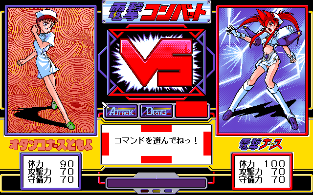

# Dengeki Nurse

This folder contains various research information regarding the game "Dengeki Nurse" developed by Cocktail Soft.

Most of the information was a byproduct of the work required for developing the assembly hacks for the game's [English translation](https://jackdbs.neocities.org/tl_dengeki) by Geometrizer and trentsignia.

## Folder contents

- [archive with game executables](executables.7z) (contains CMD/EXE/OVL/TCM files listed below)
- AdvBIOS v0.54 executable:
  - binaries: orignal EXE (`ADVBIOS.OVL`), decrypted EXE (`ADVBIOS.DEC1.OVL`), decrypted + decompressed EXE (`ADVBIOS.DEC2.OVL`)
  - disassembly: [IDB file](ADVBIOS.DEC2.idb), [ASM file](ADVBIOS.DEC2.asm)
- Adv98V v1.70.54 executable:
  - binaries: orignal EXE (`ADV98V.OVL`), decrypted EXE (`ADV98V.DEC1.OVL`), decrypted + decompressed EXE (`ADV98V.DEC2.OVL`)
  - very bare-bones disassembly: [IDB file](ADV98V.DEC2.idb)
- installer executable:
  - binaries: orignal EXE (`INSTH.EXE`), decrypted EXE (`INSTH.DEC1.EXE`), decrypted + decompressed EXE (`INSTH.DEC2.EXE`)
  - disassembly: [IDB file](INSTH.DEC2.idb), [ASM file](INSTH.DEC2.asm)
- `NRSENEMY.DAT` [format description](NRSENEMY.txt)  
  The file also includes:
  - a description of all player/enemy actions with damage calculations and other effects
  - the RAM layout during fights
- `NRSFIGHT.CMD` disassembly: [IDB file](NRSFIGHT.idb), [ASM file](NRSFIGHT.asm)
- [NRSFIGHT text dumper script](dnurse-fight2asm.py)
- `NRSOPEN.TCM` disassembly: [IDB file](NRSOPEN.idb), [ASM file](NRSOPEN.asm)
- [NRSOPEN text dumper script](dnurse-open2asm.py)
- [NRSOPEN karaoke colour data dumper script](dnurse-open-kardump.py)
- `NRSOPDT#.DAT` opening animation script [format description](NRSOPDT.txt)
- English patches:
  - [archive with English-patched game executables](executables-EN.7z) (contains CMD/EXE/OVL/TCM files listed below)
  - Adv98 BIOS (`ADVBIOS.OVL`): [ASM patch](ADVBIOS-EN.asm)  
    In order to make a patch, that is as true to an original release as possible:
    - I applied the patch onto the decompressed EXE → patched uncompresed EXE (`ADVBIOS.DEC2-EN.OVL`)
    - Then I manually applied the code and data changes to the (unencrypted) compressed EXE → patched EXEPACK-compressed EXE (`ADVBIOS.DEC1-EN.OVL`)
    - Finally I used the [XOR patch transfer script](xor-patch-transfer.py) to apply the changes to the original encrypted EXE → patched encrypted EXE (`ADVBIOS-EN.OVL`)
    - I should note that the "patched uncompresed EXE" also works just fine in place of the original executable, but doing it the way above has some extra charm.
  - installer executable (`INSTH.EXE`): [ASM patch](INSTH-EN.asm)  
    - I used the same process as with Adv98 BIOS to create a compressed and encrypted executable:
    - patched uncompresed EXE (`INSTH.DEC2-EN.EXE`) → patched EXEPACK-compressed EXE (`INSTH.DEC1-EN.EXE`) → patched encrypted EXE (`INSTH-EN.EXE`)
  - `NRSFIGHT.CMD`: [ASM file](NRSFIGHT-EN.asm), executable (`NRSFIGHT-EN.CMD`)
  - `NRSOPEN.TCM`: [ASM file](NRSOPEN-EN.asm), executable (`NRSOPEN-EN.TCM`)

## Notes

- For further notes about Adv98V and AdvBIOS, see the [Adv98V readme](../README.md).
- There is a secret cheat code in `NRSFIGHT.CMD` that makes you win the fight instantly.
  - While "Select a command!" is shown in the text box, you need to right-click certain spots in the dialogue field, which serve as virtual buttons.
  - The cheat code is "up, up, down, down, left, right, left, right", then confirm by clicking the "Power" button.
  - For the exact location of the virtual direction buttons, see the following image:  
    
  - You have to right-click to enter the cheat code. The left mouse button has no effect. (Left-clicking also does NOT reset the cheat counter.)
  - The code that does the cheat checking logic in function `CheckCheatCode` in the disassembly. The list of pixel coordinates (x1, x2, y1, y2) of the button rectangles is labelled `cheatRegions`.

    ```
    button   X range   Y range
      up    288..351  256..271
     down   288..351  320..335
     left   208..223  272..319
    right   416..431  272..319
    Power   360..423  208..239
    ```

  - The cheat code is mentioned in the "developer talk" bonus section (`TAIDAN.MES`), which can be viewed after completing the game.
  - The Dengeki Nurse page on [The Cutting Room Floor](https://tcrf.net/Dengeki_Nurse#Cheat_Code) describes the cheat code as well.
- The game comes with two different versions of the opening animation: `NRSOPDTA.DAT` and `NRSOPDTB.DAT`  
  The only difference between them is, that the `A` version plays the animation of Kirara running faster than the `B` version.
  The `B` version is probably intended for slower computers that can't update the screen as quickly as the `A` version requires.

## Gameplay notes

### Chapter 5 dungeon

Chapter 5 features a small dungeon that can be explored.
It consists of 6 floors with 5 doors on each floor.
Some doors may be protected by a barrier or a lock, which prevents entry at first.
Most of the doors lead to either an empty room or a teleporter that warps you to another floor.

Your goal is to reach the exit.

The general layout for each floor looks like this:

```
  __    __    ___    __   __
 |  |  |  |  |   |  |  | |  |
 |  |  |  |  |   |  |  | |  |
 |  |  |  |  |___|  |  | |  |
 |  |  | _|         |_ | |  |
 | _|  |-             -| |_ |
 |-                        -|
   1     2     3     4    5
```

#### List of doors and rooms

- floor 1F:
  - Door 1: teleporter (normal) → floor 5F
  - Door 2: empty
  - Door 3: teleporter (panda) → floor 3F
  - Door 4: empty
  - Door 5: empty
- floor 2F:
  - when entering the first time: [battle] Momoko
  - Door 1 (barrier): empty
  - Door 2: teleporter (normal) → floor 6F
  - Door 3 (barrier): teleporter (normal) → floor 1F
  - Door 4 (barrier): teleporter (panda) → floor 4F
  - Door 5: empty
- floor 3F:
  - Door 1 (barrier): empty
  - Door 2: teleporter (normal) → floor 5F
  - Door 3 (lock): exit
  - Door 4 (barrier): teleporter (normal) → floor 1F
  - Door 5: [battle] Asuka → barrier control device
- floor 4F:
  - Door 1: teleporter (normal) → floor 5F
  - Door 2: teleporter (panda) → floor 6F
  - Door 3: [battle] Guillotine Nurse → get Elektros Crest (unlocks 3F door 3)
  - Door 4: empty
  - Door 5: teleporter (normal) → floor 2F
- floor 5F:
  - Door 1 (barrier): empty
  - Door 2: teleporter (normal) → floor 6F
  - Door 3 (barrier): teleporter (panda) → floor 2F
  - Door 4: empty
  - Door 5: [battle] Tomoyo → pipe
- floor 6F:
  - Door 1: teleporter (panda) → floor 1F
  - Door 2 (barrier): empty
  - Door 3: empty
  - Door 4: teleporter (normal) → floor 5F
  - Door 5 (barrier): [battle] Ayako → get key to Kirara's room

#### Optimal dungeon path

Notes:
- This path assumes that you can not use the panda teleporter at first. (behaviour of the bugfixed English translation)
  In the original release, you can use the panda teleporter immediately due to a bug in the script code.

Walkthrough:

- 1F, door 1 → teleport to 5F
- 5F, door 5 → enter pipe to get coins for panda teleport
- 5F, door 2 → teleport to 6F
- 6F, door 1 → teleport to 1F
- 1F, door 3 → teleport to 3F
- 3F, door 5 → turn barrier off
- 3F, door 2 → teleport to 5F
- optional detour:
  - 5F, door 2 → teleport to 6F
  - 6F, door 5 → get key to Kirara's room
  - 6F, door 4 → teleport to 5F
- 5F, door 3 → teleport to 2F
- 2F, door 4 → teleport to 4F
- 4F, door 3 → get Elektros Crest 
- 4F, door 5 → teleport to 2F
- 2F, door 3 → teleport to 1F
- 1F, door 3 → teleport to 3F
- 3F, door 3 → exit
