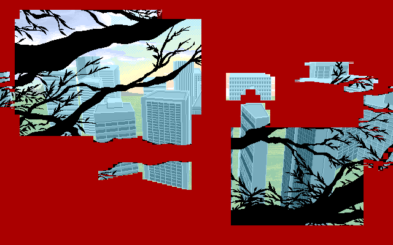

# Fixed files for MIME

This folder contains a bunch of fixed files for the game.

- [scenarios](scenarios/README.md] - fixes and improvements for game scripts
- [Z1000.DAT](Z1000.DAT) - a fix for the "new game" file of the MIME v2 update
  - When they added more passable walls for the v2 update, they broke the 1F maze map at coordinate (1,15). You can leave the map there by going south with no way to return.
  - You can also leave the map in 3F at coordinate (14,15).
  - The new file fixes the map so that it behaves (and looks) as intended.
  - Since the map is entirely stored inside each save game, this fixes the map only when you start a new game.
- [L130B.GTA](L130B.GTA) / [L130C.GTA](L130C.GTA) / [L130D.GTA](L130D.GTA) / [L130E.GTA](L130E.GTA) - fixes for the staff roll background images
  - The developers at Studio Twin'kle size-optimized the images by only storing differential updates to the screen. They did this especially for full-screen images.
  - During the ending, the folllowing images are loaded: (in this order):
    - L129I (temporary overlay: ST\_01..04)
    - L130A (temporary overlay: ST\_05..08)
    - L130B (temporary overlay: ST\_09..11)
    - L130C (temporary overlay: ST\_12..13)
    - L130D (temporary overlay: ST\_14..15)
    - L130E (temporary overlay: ST\_16..20)
    - L130F (overlay: ST\_21)
  - Their optimization algorithm introduced some transparent 8x1-pixel-blocks in the buildings. These get problematic when you are editing the credits text images.
  - The fixed images replace these transparent blocks with the intended colours.
  - In `L130B`, I also removed a few pixels in the centre of the screen that were drawing an incorrect border to one of the buildings. The border would be removed by the next image (L130C), so I consider this a mistake.
  - The folder includes PNGs of the images before and after the fix.
  - L130B before:  
    
  - L130B after:  
    
- [D01_mod.N](D01_mod.N) - version of `D01.N` that was modified to fix a "NO INSTRUMENT" error when played back on a Roland SC-88
- [STMED.GTA](STMED.GTA) - fixed missing white pixels in the first row
