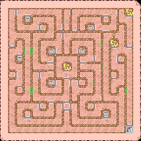
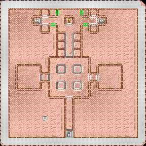
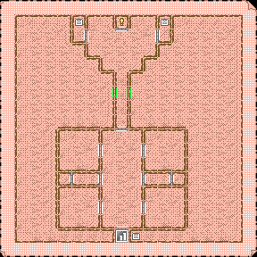
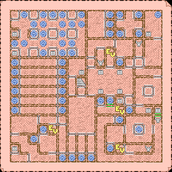

# Maps and locations

## Maps

Notes:

- green lines indicate passable walls
- red lines indicate collision errors (e.g. being able to leave the map or not being able to pass when no wall is visible)

Map images:

- Character Building Maze (map 14):  
  

  Note: The event marker with the red border is broken in the original game. (The map script incorrectly checks coordinate 2,2 while the event handling script checks for the correct location 2,6.)
- 1F:  
  

  Note: The passage from 0,1 to 0,2 is closed first and is opened by a story event.
- 2F:  
  

  Note: The passage from 7,8 to 7,7 is closed first and is opened by a story event.
- 3F:  
  
- 4F:  
  
- 5F:  
  
- 6F:  
  
- 7F:  
  
- 8F:  
  
- 9F:  
  
- 10F:  
  
- 11F:  
  
- 12F:  
  
- 13F:  
  
- B1F (0F):  
  

## Map B1F Teleports

For target points, the direction after exiting the teleport is noted.

### 1-way teleports

| Source  |   Target    |
|:-------:|:-----------:|
|  6, 15  |  9, 7 west  |
|  5,  9  | 11, 7 east  |
|  0,  5  |  6, 2 north |
| 10, 14  |  7, 5 west  |
|  6,  4  |  4, 2 east  |
|  4,  0  |  6, 0 south |
|  5,  4  |  2, 4 north |
|  2,  2  |  2, 0 south |
|  0,  3  |  0, 0 east  |
|  6,  1  | 14, 8 north |
|  1,  0  | 14, 8 north |
|  3,  3  | 14, 8 north |
|  3,  0  | 14, 8 north |
|  3,  2  | 14, 8 north |
|  5,  1  |  7, 8 north |
|  1,  3  |  7, 8 north |
|  2,  1  |  7, 8 north |
|  6,  3  | 12, 1 north |
|  5,  3  | 12, 1 north |
| 15,  0  | 12, 1 north |
|  5,  0  | 12, 1 north |
|  7,  1  | 10, 7 north |
|  3,  1  | 10, 7 north |
|  7,  0  | 10, 7 north |
|  5,  2  | 10, 7 north |
|  3,  4  | 10, 7 north |

### 2-way teleports

|   Point 1    |   Point 2    |
|:------------:|:------------:|
|  0,  6 east  | 10,  2 west  |
|  0,  7 east  |  5, 15 north |
|  0,  8 east  | 13,  2 north |
|  0,  9 east  | 13,  0 west  |
|  0, 10 east  | 11,  0 south |
|  2, 13 east  |  5,  6 west  |
|  7, 15 north |  5, 10 west  |
|  8, 15 north | 11, 11 west  |
|  9,  9 south |  5,  5 west  |
| 10,  9 north | 10,  1 west  |
| 11,  2 east  | 10,  0 west  |
| 11,  5 north |  5,  7 west  |
| 12, 10 north |  3, 12 south |
| 13, 12 east  |  5,  8 west  |

## Misc

- [List of locations](MapLocations.tsv) - includes stairs/ropes, teleports, locations (i.e. shops/etc.) and special events
