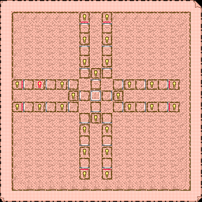
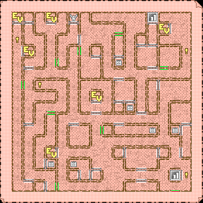
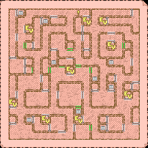
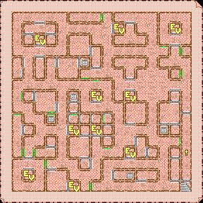
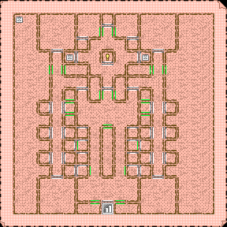
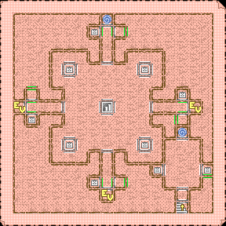

# Maps and locations

## Maps

Notes:

- green lines indicate passable walls
- red lines indicate collision errors (e.g. being able to leave the map)

Map images:

- Character Building Maze (map 14):  
  
- 1F:  
  
- 2F:  
  
- 3F:  
  
- 4F:  
  
- 5F:  
  
- 6F:  
  
- 7F:  
  
- 8F:  
  
- 9F:  
  
- 10F:  
  
- 11F:  
  
- 12F:  
  
- 13F:  
  
- B1F (0F):  
  

## Misc

- [List of locations](MapLocations.tsv) - includes stairs/ropes, teleports, locations (i.e. shops/etc.) and special events
