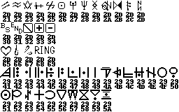

# Gameplay notes and algorithms

## TOC

- [General](#general)
- [Battle](#battle)
- [Black Rose](#black-rose)
- [Character Building](CharacterBuilding.md) (separate file)
- [Debug Mode](#debug-mode)
- [Food and Drinks](#food-and-drinks)
- [Magic Tablet](#magic-tablet)
- [Maps and locations](Maps.md) (separate file)
- [Random Number Generation](#random-number-generation)
- [Sadao's Shop](#sadaos-shop)
- [Trust Level and Endings](#trust-level-and-endings)

## General

**Note:** The documents here use texts from sainttimmy's English translation of MIME.

## Ancient Language

There is an "ancient language" in the game that only Tear can read.
She will usually translate it for everyone else, except for monster dialogues.

The language is actually just Romanized Japanese words, with a font that has heavily stylized Latin letters.
You can see the letters A..Z in the last two rows of the image below:



Internally, the game uses the JIS "ASCII mirror" codes to encode the ancient language (Shift-JIS codes 8561..857A), so they are easily readable in the decompiled scripts.

Example for the ancient language from floor 2F, map location 11,9:

- ingame:  
  
- Latin letters:  
  「FUTATABI HOROBINO‥‥」  
  「KAZEGA FUKU‥‥」
- Tear's in-game translation:  
  “Once again, the winds of ruin blow...”

## Battle

- There are no encounters for 3 steps after returning to the dungeon screen after an event or battle.  
  After that, the enemy encounter rate is 1/16 for each step.
  The internal formula is: `(random() % 16) == 7` (see Z0001.DAT/loc\_227F)
- When defeating a monster, the characters gain:
  - exactly the amount of experience points defined by the monster table (register 10120)
  - the amount of RING defined by the monster table (register 10134) + an additional random 0..5 RING
- Register r388 is the "boss flag". It is 0 for normal enemies and 1 for bosses.
  When it is on, you can not talk to the enemies and escaping is impossible.
- When entering a battle, there is a 50% chance that the monster can talk to you.
- Battle Escape conditions:
  - Each way of escaping has different actions with varying chances. The results are determined by RNG in the range of `[1..10]` or `[1..20]`, depending on the action.
  - For some actions, there is a chance of obtaining or losing RING. The exactly amount is also determined by RNG and is always in the range of `[10..100]`.
  - Bolt Away:
    - summary: 50% success, 50% failure, 40% chance of losing RING
    - 2/10: "The monsters followed behind!!" "And caught up!!" (failure)
    - 2/10: "But the monsters shrieked and matched their movements!!" (failure)
    - 1/10: "But the monsters caught up with them!" (failure)
    - 1/10: "The monsters bolted away and ran as well!" (success)
    - 4/10: "But they ran too fast and dropped # RING in the process!" (success, lose 10..100 RING)
  - Back Away:
    - summary: 80% success, 20% failure, 15% chance of losing RING
    - 1/20: "But backed around back into the monsters!!" (failure)
    - 1/20: "\[Player\] slipped on a banana peel!!" "While also scattering # RING across the floor!" (failure, lose 10..100 RING)
    - 1/20: "\[Player\] tripped on a pebble!!" "While also scattering # RING across the floor!" (failure, lose 10..100 RING)
    - 1/20: "\[Player\] fell on their back!!" "While also scattering # RING across the floor!" (failure, lose 10..100 RING)
    - 16/20: "The monsters also backed away until they couldn't be seen again!!" (success)
    - *Possible bug:* The RNG is probably supposed to be in the range of only `[1..10]` here.  
      This would double the chance for each of the "failure" actions and decrease the success rate to 40%, which is similar to the probabilities of the other choices.
  - Turn Away:
    - summary: 40% success, 60% failure, 20% chance of gaining RING
    - 5/20: "The monsters watched and got dizzy!!" (success)
    - 2/20: "But the monsters did a somersault and caught up!!" (failure)
    - 1/20: "The monsters clapped in amusement." "They threw # RING at them!!" (success, gain 10..100 RING)
    - 1/20: "The monsters stared at them in silence." "The monsters sighed, tapped \[Player\] on their shoulder, and gave them # RING." (success, gain 10..100 RING)
    - 1/20: "The monsters tried imitating them by spinning in place!" "And were left there!" (success)
    - 10/20: "\[Player\] got dizzy and fell down!!" (failure)
  - Handstand:
    - summary: 40% success, 60% failure, 40% chance of losing RING, 20% chance of gaining RING
    - 2/10: "But the contents of their pockets fell onto the floor!!" "# RING were lost!" (failure, lose 10..100 RING)
    - 2/10: "But # RING fell out onto the floor!!" "The monsters snatched them up!" (success, lose 10..100 RING)
    - 2/10: "The monsters tried to imitate the act!" "The monsters successfully learned how to do a handstand!!" "The monsters shook \[Player\]'s hand, gave them "# RING and left." (success, gain 10..100 RING)
    - 1/10: "The monsters tried to imitate the act!" "But they couldn't seem to get it down!!" "The monsters get angry at \[Player\]!" (failure)
    - 3/10: "\[Player\] couldn't avoid the monsters catching up to them!!" (failure)
  - Recommendations:
    - "Back Away" has the highest chance of success (80%).
    - "Turn Away" is the least risky choice, if you care about your money, as you can not lose RING there.
- [List of monsters](Monsters.tsv) - list of all monsters and their attributes
- [List of monster groups](MonsterGroups.tsv) - list of all groups of monsters that can be encountered on each floor
- [Monster Talks](MonsterTalk.md) - list of all monster groups and their reply when you talk to them

## Black Rose

Each of the girls in the Black Rose brothel has its own requirement before serving you.

- The Twin Sisters "Dana and Donna": pay 999 RING
- The Relaxed Girl "Stella": pay 999 RING
- The Little Devil "Elvira": have item "Rare Skull", then item "Super Rare Skull"
- The Sadist "Chloture": be level 30 or higher
- The Warrior "Ashley": have item "Evil Sword"
- The Elf Girl "Cass": pay 999 RING
- ??????? "Tenko-chan": defeat the Chimera boss

## Debug Mode

There is a debug mode left in the game's release version. It has the following features:

- during dungeon movement:
  - allow you to instantly quit the game by clicking in the region (0,0)..(32,32) (top left edge of the screen)
  - open a debug menu by clicking in the region (0,368)..(32,400) (bottom left edge of the screen)
  - jump to the "Window Girl" by clicking in the region (608,0)..(640,32) (top right edge of the screen)
  - enter test mode by clicking in the region (608,368)..(640,400) (bottom right edge of the screen)
- allow you to warp to any maze on the "Window Girl" screen
- add rune stone descriptions to the magic stone tablet screen
- give you extra options in the battle:
  - "I love Morrigan" - restores all HP and MP to all characters
  - "End" - instantly ends the battle

In order to enable debug mode, you have to enter one of the following 7 names as your player's name and hold the Shift key while confirming the name.
The game will play a special sound effect to confirm the cheat code and change the player's name to another name as shown below.

- `のぎやま` (Nogiyama) → `野木山❤` (Nogiyama❤)
- `おきやま` (Okiyama) → `爆音小僧` (Bakuon Kozou)
- `あさい` (Asai) → `レイレイ` (Lei-Lei)
- `マサキＤ` (MasakiD) → `三石ﾕ渠` (Mitsuishi Yuko)
- `むっち～` (Mucchi~) → `火野レイ` (Hino Rei)
- `メイロン` (MEIRONG) → `リュウ` (Ryuu)
- `だば` (Daba) → `天陳影久` (Tenchin Eikyuu)
- Thanks to saintttimmy for transcribing the names.

Internally, debug mode is enabled by setting a flag in script register 394. (offset 0x314 in the saved game)
There is a separate bit set for each name, but the game generally only checks whether or not the register is set to 0, so all of the names have the same effect.

## Food and Drinks

Each type of food, drink and dessert reduces the Hunger Level by a certain amount.

### Noah's Bar

| Food / Drink / Dessert| Cost  | Huger reduction |
| --------------------- | ----- | --- |
| Noah Bowl             |  30   |  40 |
| Noah Soba             |  30   |  40 |
| Noah Pizza            |  40   |  50 |
| Noah Burger           |  40   |  50 |
| Noah Chanko           |  50   |  60 |
| Noah Curry            |  50   |  60 |
| Noah Ramen            |  50   |  60 |
| Noah Stew             |  50   |  60 |
| Noah Steak            |  70   |  80 |
| Noah Full Course      |  90   | 100 |
| Noah Yum Cha          |  90   | 100 |
| Green Tea             |   8   |  10 |
| Oolong Tea            |   8   |  10 |
| Juice                 |   8   |  10 |
| No-Ah Sake            |  35   |  50 |
| Noah Beer             |  35   |  50 |
| Noah Whiskey          |  35   |  50 |
| Noah Special Cocktail |  35   |  50 |
| Noah Parfait          |  40   |  60 |
| Pudding Noah la Mode  |  40   |  60 |
| Black Tea + Noah Cake |  35   |  50 |
| Coffee + Noah Cake    |  35   |  50 |

### Antonio's Inn

It should be noted that the "Noah"-Drinks are a bit more expensive in Antonio's Inn than they are in Noah's Bar.

| Food / Drink / Dessert| Cost  | Huger reduction |
| --------------------- | ----- | --- |
| No-Ah Sake            |  50   |  50 |
| Noah Beer             |  50   |  50 |
| Noah Whiskey          |  50   |  50 |
| Manbattan             |  80   |  80 |
| Screwanton SP         | 100   | 100 + make drunk |

Being drunk does not have any effect on the gameplay, except for the changed music and faces.

## Magic Tablet

At coordinate 2,0 on floor 2F, there is a Magic Tablet that allows you to learn spells and craft items.  
This is done by placing 6 rune stones on the tablet.

You can find a list of all spells and items and their requirements here:
[MagicTablet-List.tsv](MagicTablet-List.tsv)

Note that even though the the list (which was generated from the game's script file) may suggest that the order matters, it does not.
You can place the stones in any order and it will work as long as you place the correct number of each stone.

## Random Number Generation

- The game has a global random number generator (RNG) that it uses to determine many of its actions.
  - initialization

    ```
    word_1DD52 = [value based on current date and time]
    word_1DD54 = 0
    ```

  - RNG step: (I will just quote the x86 assembly for now.)

    ```asm
    RNG_GetNext:
            mov     cx, word_1DD54
            mov     bx, word_1DD52
            mov     dx, 16838
            mov     ax, 20077
            call    RNG_Advance
            add     ax, 12345
            adc     dx, 0       ; add overflow of previous addition
            mov     word_1DD54, dx
            mov     word_1DD52, ax
            mov     ax, word_1DD54
            and     ax, 7FFFh   ; return (word_1DD54 & 7FFFh)
            retf

    RNG_Advance:
            push    si
            
            xchg    ax, si  ; SI = 20077
            xchg    ax, dx  ; AX = 16838
            
            test    ax, ax
            jz      short loc_10B23
            mul     bx      ; AX = 16838 * word_1DD52, DX = high 16 bits of the result
    loc_10B23:
            
            jcxz    short loc_10B2A ; skip when word_1DD54 == 0
            xchg    ax, cx
            mul     si
            add     ax, cx  ; AX = word_1DD54 * 20077 + AX, DX = high 16 bits of the mult. result
    loc_10B2A:
            
            xchg    ax, si
            mul     bx      ; AX = 20077 * word_1DD52
            add     dx, si  ; DX += 20077
            
            pop     si
            retf
    ```

  - The scripts usually request the result to be in a specific range.
    The 15-bit result of the RNG is limited using a simple modulo operation: `result = random() % range`

## Sadao's Shop

Out of the 3 shops, Sadao is the only one that changes his shop's supplies throughout the game.
The offered products change slightly every time you get a new character into your parts.

It should be noted that he removes some items when Henzou joins your party:

- item 0: Cheap Candy (heal 25 HP)
- item 1: Candy (heal 50 HP)
- item 11: Chocolate (reduce Hunger level by 10)
- item 13: Rice Ball (reduce Hunger level by 30)

Those items get replaced with stronger (but more expensive) equivalents.

## Trust Level and Endings

The game features a "trust level" for the relation of Eagle to other members of the parts.
It is increased at certain points in the game, when you can pick between the three characters.

The trust level determines dialogue and images during the second part of the ending: You get the ending with character with the highest trust level.
For breaking ties, Tear gets the highest preference, then Eldelyca.

The ingame algorithm is:

- Tear's trust level is >= Henzou's and Eldelyca's → Ending 1 (Tear Ending)
- Henzou's trust level is > Tear's and it is > Eldelyca's → Ending 2 (Henzou Ending)
- Eldelyca's trust level is > Tear's and it is >= Henzou's → Ending 3 (Eldelyca Ending)

The trust level is increased during the following scenes:

- A112 "Stella" (brothel):
  - After the dialogue "Listening to Stella's words, one person came to the front of my mind.", you get to choose whom of your party members you are thinking of.
    - Tear
    - Henzou
    - Eldelyca
    - no one
  - The chosen person's trust level is increased by 1.
- A200A "The Three Dwarfs":
  - After the dialogue "Listen, Eagle... which are ya aiming for?", you must choose between:
    - Tear
    - Eldelyca
    - Henzou
    - Dwarf
  - The chosen person's trust level is increased by 1.
- A201B "Phantom Castle" (Tear only)
  - When you give Maid Toppo the golden apple and thus save Tear, her trust level is increased by 10.
  - Note: This is a mandatory story event.
- A503 "Crystal Forest"
  - When Alaia asks you to search for her gemstone, you get to choose:
    - Yes
    - on Tear's behalf
    - on Henzou's behalf
    - on Eldelyca's behalf
  - The chosen person's trust level is increased by 2. Agreeing without conditions does not increase any trust level.
  - Later, when everybody is sleeping and you wake up, you can:
    - Go back to sleep
    - Look for Tear → increases Tear's trust level by 1
- A602 "Black Ball" / A605 "White Ball"
  - You can do various tasks with your party members here.
    - dance → increase trust level by 1
    - eat → increase trust level by 1
- A607 "Music Box Boy":
  - When get asked, who takes the doll, the first choice ("Take the doll") increases the trust level for all 3 parters by 1.
  - All other choices (i.e. not taking the doll or wanting a kiss) have no effect.

Due to the story event of Tear's awakening, she effectively starts with a trust level of 10 while Henzou and Eldelyca start at 0.
This means that in order to get the alternate ending scenes, you have to repeat the dance/eat tasks during the black and white ball a few times in order to increase the respective member's trust level.
